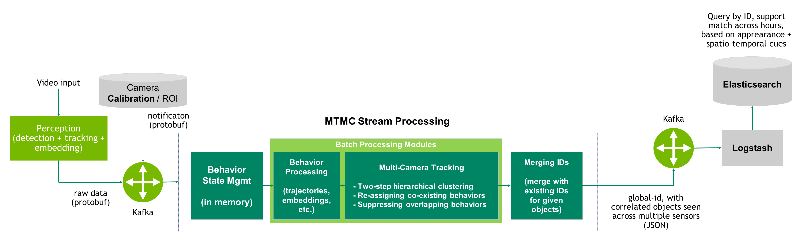
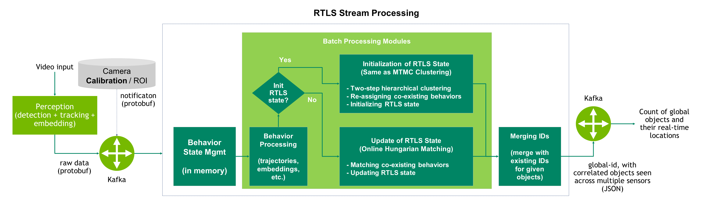

# Multi-Camera Tracking

## Introduction

The`mtmc-analytics` pipeline first transforms raw data into behaviors, including trajectories and embeddings. Then these behaviors are clustered and global IDs are assigned, leveraging both re-identification (ReID) features and spatio-temporal information.

The system supports two primary modes of multi-camera tracking: Multi-Target Multi-Camera (MTMC) Tracking and the Real-Time Location System (RTLS). Each mode can be executed in one of two operational styles within the Python framework: Batch Processing or Stream Processing. Additionally, the pipeline offers modules for both evaluation and visualization.

``Batch Processing`` mode handles raw data from local files, processing the entire dataset as a single batch.

``Stream Processing`` mode deals with live data input from a Kafka topic, processing information in micro-batches. This approach maintains the state of behavioral data, integrating new clustering results with pre-existing IDs.

``MTMC Tracking`` clusters live behaviors using hierarchical clustering, further refining these clusters through iterative reassignment with Hungarian matching. This method offers multi-camera tracking results at every frame with higher accuracy.



``RTLS`` starts by initializing clusters and then continuously updates the positions of global IDs using online Hungarian matching. This approach offers real-time location updates.



This guide outlines the procedural steps for manually executing the multi-camera tracking components. For a comprehensive understanding and additional details, please consult the multi-camera tracking web documentation pertaining to the MTMC Analytics SDK.

## Manual Deployment

Please refer to the multi-camera tracking web documentation for steps on customizing the components for different use cases.

### Pre-requisites

1. Nvidia Driver v470.57.02+ ([CUDA Toolkit](https://developer.nvidia.com/cuda-toolkit-archive))
2. Python v3.10+ ([Anaconda Distribution](https://www.anaconda.com/products/distribution))
3. Input raw data file in JSON string or protobuf format (for batch processing)
4. Kafka broker serving raw data (for stream processing)
5. Update configuration in `resources/app_mtmc_config.json` or `resources/app_config_rtls.json`.

### Deployment commands

[Optional] Create a virtual environment using Conda:

```bash
conda create -n mtmc_analytics python=3.10
conda activate mtmc_analytics
conda install jupyter notebook
```

Clone the repository:

```bash
git clone https://gitlab-master.nvidia.com/metromind/mdat/mtmc/mtmc_analytics.git
cd mtmc_analytics
```

Install requirements:

```bash
pip3 install -r requirements.txt
```

You can download the videos and playback data from here [[link]](https://registry.ngc.nvidia.com/orgs/nfgnkvuikvjm/teams/mdx-v2-0/resources/metropolis-apps-sample-input-data/files). Extract the contents from the compressed file:

```bash
tar -xf metropolis-apps-data.tar.gz
```

### MTMC Tracking

#### Batch Processing

Set the config `io.jsonDataPath` or `io.protobufDataPath` in `resources/app_mtmc_config.json` as a valid input file of data.

Run the `main_batch_processing` script:

```bash
python3 -m main_batch_processing --config resources/app_mtmc_config.json --calibration resources/calibration_building_k.json
```

To run evaluation: 
* Set the config `io.outputDirPath` in `resources/app_mtmc_config.json` to a valid directory
* Set the config `io.groundTruthPath` in `resources/app_mtmc_config.json` as a valid ground-truth file in MOT format
* [Optional] Set the config `io.useFullBodyGroundTruth` in `resources/app_mtmc_config.json` to `true` if the ground truth consists of full-body bounding boxes for occluded objects
* [Optional] Set the config `io.use3dEvaluation` in `resources/app_mtmc_config.json` to `true` if the ground truth consists of 3D locations on the ground plane
* [Optional] To visualize detection, association and localization metrics, enable `io.plotEvaluationGraphs` in `resources/app_mtmc_config.json`
* Run the `main_batch_processing` script

#### Stream Processing

Run the `main_stream_processing` script (please change the IP address of the `streaming.kafkaBootstrapServers` config in `resources/app_mtmc_config.json` if needed):

```bash
python3 -m main_stream_processing --config resources/app_mtmc_config.json --calibration resources/calibration_building_k.json
```

#### Visualization

For visualization, the ground-truth bboxes and locations can be plotted from the ground-truth file in the MOTChallenge format. To plot frames, behaviors and MTMC objects of the prediction, please save the batch processing results to the `results` directory as follows by setting `io.enableDebug` as `true` in `resources/app_mtmc_config.json`:

```bash
results
    behaviors.json
    frames.json
    mtmc_objects.json
```

Run the `main_mtmc_visualization` script (the map image of floor plan needs to be provided for the visualization of MTMC objects in top view and ground-truth locations):

```bash
python3 -m main_mtmc_visualization --config resources/viz_mtmc_config.json --calibration resources/calibration_building_k.json
```

#### Notebooks

The notebook `viz_e2e_mtmc_results.ipynb` can be used for end-to-end MTMC batch processing and visualization.

The notebook `inspect_anomalies.ipynb` can be used for inspection of anomalies.

### RTLS

#### Batch Processing

Set the config `io.protobufDataPath` in `resources/app_rtls_config.json` as a valid input file of data.

Run the `main_mtmc_plus_batch` script:

```bash
python3 -m main_mtmc_plus_batch --config resources/app_rtls_config.json --calibration resources/calibration_retail_synthetic.json
```

#### Stream Processing

Run the ``main_mtmc_plus` script (please change the IP address of the `streaming.kafkaBootstrapServers` config in `resources/app_rtls_config.json` if needed):

```bash
python3 -m main_mtmc_plus --config resources/app_rtls_config.json --calibration resources/calibration_retail_synthetic.json
```

#### Evaluation

First log the RTLS results from the Kafka topic of `mdx-rtls` using the following Kafka consumer script. Note that the frame IDs are required in the RTLS results for evaluation/visualization, which can be done by setting `io.enableDebug` as `true` in `resources/app_rtls_config.json`.

```python
import json
from kafka import KafkaConsumer


consumer = KafkaConsumer(
    "mdx-rtls",
    bootstrap_servers="<kafka-bootstrap-servers>"
)

with open("results/mdx-rtls.log", "w") as f:
    for msg in consumer:
        f.write(f"{msg.value}\n")
        print(msg.value)
```

Set the configuration parameters in the `evaluate_rtls_results.ipynb` notebook and run the notebook. 

#### Visualization

First log the RTLS results from the Kafka topic of `mdx-rtls` using the above Kafka consumer script. Please set `io.enableDebug` as `true` in `resources/app_rtls_config.json` to save frame IDs in the RTLS results.

Then configure the parameters in `viz_rtls_config.json`, especially the input and output paths.

Run the `viz_rtls_results.ipynb` notebook to create RTLS visualization.

## Acknowledgements

This project utilizes a portion of code from [TrackEval] (https://github.com/JonathonLuiten/TrackEval), an open-source project by Jonathon Luiten for evaluating multi-camera tracking results. 
TrackEval is licensed under the MIT License, which you can find in full [here](https://github.com/JonathonLuiten/TrackEval/blob/master/LICENSE).
